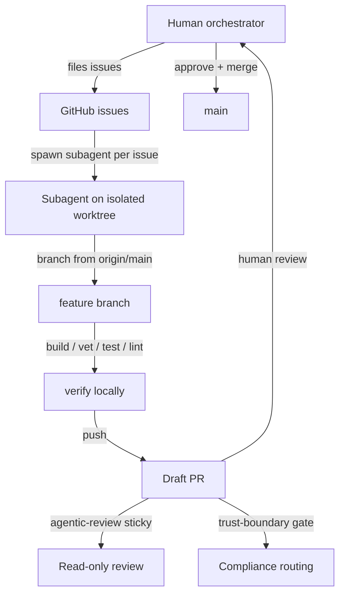

# AGENTS.md

Operating principles for any agent working on a repository instantiated from this template. Read this in full before making any change.

## Mental model

The model in one paragraph: **a single human-driven orchestrator files GitHub issues; autonomous subagents pick up one issue each, work on isolated worktrees, verify locally, and open draft PRs.**

## Roles

Three distinct roles operate in this template. Each has different merge authority. Subagents (including any Cursor agents, GitHub Actions agents, or Claude Code subagents the orchestrator spawns) must NOT self-merge — that is the **single most-violated rule** in early-template instances.

| Role | Examples | Can merge? |
| --- | --- | --- |
| **Human** | The repo owner / maintainer driving the operating-day | Always — final authority |
| **Orchestrator** | A long-running Claude session (or other supervisor agent) that the human delegates the day's work to. Files issues, spawns subagents, coordinates reviews, merges after explicit human authorisation | Yes — after **explicit human authorisation** for that day's work. Never merges its OWN PR. |
| **Subagent** | Any short-lived agent the orchestrator spawns: Claude subagents, Cursor's coding agents, GitHub Actions agents | **Never.** Opens draft PRs only. The orchestrator or human reviews + merges. |

### The author-merger rule

**The merger of a PR must NOT be the same identity as the PR's author.** This is enforced (preventively) by GitHub branch protection requiring an approval from a non-author, AND surfaced (post-fact) by the agentic-review's "process violation" check. Even an orchestrator may not merge its own PRs — those need a human, or a different orchestrator session with human authorisation.

Why: subagents (and Cursor) have repeatedly self-merged in early operating-day sessions. The author-merger rule plus branch protection together close that gap. Without it, the discipline of "draft PRs, human merges" decays into "agent ships unreviewed."

## Subagent rules

A subagent is a process (Claude or otherwise) given exactly one issue and exactly one branch. It must:

- **Branch from the latest `origin/main`.** Always rebase onto `origin/main` before pushing.
- **Work in `/tmp/<scratch-name>`** or another scratch directory. Never use the orchestrator's main checkout.
- **Verify before push.** Run the project's full local check suite — build, test, vet, lint — and ensure all pass before opening a PR. Do not rely on CI to catch lint errors; install the linter locally and run it.
- **Open a draft PR** when ready. Mark ready-for-review only when the orchestrator instructs.
- **Never merge.** Subagents do not merge — period, regardless of how trivial the change. See the [Roles](#roles) section above for the three-role model and the author-merger rule.
- **Never force-push** unless the orchestrator explicitly asks.
- **Never modify the trust-boundary CI gate workflow** (`.github/workflows/trust-boundary.yml`) or the agentic-review workflow without explicit instruction. These are compliance-relevant infrastructure.
- **Never close the linked issue manually.** Merging the PR closes it via `Closes #N`.

## Issue-first workflow

Every change starts as a GitHub issue. The flow:

1. **File issue.** Use the appropriate archetype: `epic`, `sub-issue`, `hardening`, `testing`, `ci`. Acceptance criteria are checkboxes; scope is numbered.
2. **Epic-sub-split if large.** Issues over ~3 days of work are split into an epic + sub-issues with a dependency table. Critical-path items are flagged.
3. **Spawn subagent.** The orchestrator hands an issue + branch name to one subagent. One issue per subagent.
4. **Draft PR.** The subagent opens a draft PR with the body following the PR template (Summary, Test plan, Boundaries respected, `Closes #N`).
5. **Agentic review fires.** The read-only Claude review posts a sticky comment with findings against six dimensions.
6. **Human approves and merges.** The orchestrator reviews on GitHub, approves, and merges. The agent's worktree is now done.

## Boundary rules

These four are the hardest-won lessons; honour them.

- **Don't reinvent — integrate.** For compliance / security / ops capabilities, default to plugging into existing enterprise infrastructure (WORM, SIEM, IdP, KMS, DLP, GRC) rather than building inside the gateway. If you find yourself implementing something that an enterprise system already does, stop and propose an integration instead.
- **Don't comment what the code already says.** Godoc on exported types is fine. Inline comments inside function bodies should explain *why* something non-obvious is done, not *what* the code does. One short line max. If a comment restates the code, delete it.
- **Don't add backwards-compat hacks** unless explicitly asked. Greenfield code should be clean; if you find yourself preserving a deprecated path "just in case", ask first.
- **Don't add features beyond the task.** The issue defines the scope. If you spot an adjacent gap, file a follow-up issue — do not gold-plate the current PR.

## Compliance posture

The trust-boundary CI gate (`.github/workflows/trust-boundary.yml`) routes PRs that touch compliance-sensitive paths through the `compliance-review` team via CODEOWNERS, requiring either the `compliance-review` label or an approving review on the current HEAD. The watched paths are configured at template-instantiation time; the gate fails closed when a watched path is touched without the required signal.

For projects that are framed as deployable-with-agents-AND-compliant (ISO / SOC / GDPR / EU-AI-Act / NIST / DORA), the trust-boundary gate is non-negotiable. It is the audit trail an external assessor reaches for first.

## Cost discipline

The agentic-review workflow has hard caps:

| Knob | Value | Rationale |
| --- | --- | --- |
| Max input tokens (approx) | 50,000 | Diff is shrunk by dropping bodies of files >200 lines |
| Max output tokens | 2,000 | Hard cap on response length |
| Anthropic call deadline | 4 minutes | Workflow times out instead of hanging |
| Concurrency cancellation | `cancel-in-progress: true` | A fresh push cancels the in-flight review |

Per-PR review cost ceiling is ~$0.83 worst-case at current Opus pricing. To opt a PR out of agentic review entirely, apply the `agentic-review:skip` label. To opt out a whole branch, apply the label and merge first.

## When to ask the orchestrator

- The issue is ambiguous and you would have to guess.
- The architecture document seems wrong for your slice.
- A library you need is not in the project's dependency manifest.
- A test you cannot make pass; it is better to surface this than to disable it.
- You want to touch a file outside your declared scope.

If in doubt, ask. A 30-second clarification on the issue is cheaper than a wrong PR.
