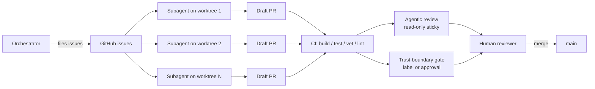

# claude-code-setup

> Opinionated template for running an orchestrator + autonomous-subagent setup against a single GitHub repository, distilled from operating practice on [`jk-nd/go-mcp-gw`](https://github.com/jk-nd/go-mcp-gw).

## TL;DR

| | |
| --- | --- |
| What you get | Agentic PR review (read-only), trust-boundary CI gate, CODEOWNERS, issue + PR templates, `AGENTS.md` operating principles, bootstrap script |
| What you bring | A language-specific `ci.yml` (template ships a Go example), team handles, branch-protection settings |
| How to start | Click "Use this template" on GitHub, then run `scripts/bootstrap.sh` |
| Required secret | `ANTHROPIC_API_KEY` (for agentic review) |
| Cost ceiling | Per-PR review capped at ~$0.83 worst case; opt-out via the `agentic-review:skip` label |

## What this gives you

The four moving parts:

1. **Orchestrator + subagents on worktrees.** One human-driven orchestrator files issues; subagents work autonomously on isolated branches, opening draft PRs.
2. **Agentic PR review** (`.github/workflows/agentic-review.yml` + `cmd/agentic-review/`). Read-only Claude review on every non-draft PR push, posting a sticky comment with findings against six dimensions (lint, tests, citations, issue refs, architectural invariants, stale claims).
3. **Trust-boundary CI gate** (`.github/workflows/trust-boundary.yml`). Compliance-routed PRs require either the `compliance-review` label or an approving review on the current HEAD; sticky comment summarises which paths tripped the gate.
4. **Issue + PR templates** (`.github/ISSUE_TEMPLATE/`, `.github/PULL_REQUEST_TEMPLATE.md`). Five issue archetypes (epic, sub-issue, hardening, testing, ci) and a PR template that mirrors the structure agents follow.

## How to use

1. Click **Use this template** in the GitHub UI to create a new repo from this one.
2. Clone the new repo locally.
3. Run `scripts/bootstrap.sh`. The script will:
   - Detect owner/name from `gh repo view`.
   - Substitute `${OWNER}`, `${REPO}`, `${WATCHED_PATHS}` placeholders across `*.template` files and rename them to their final names.
   - Prompt for `ANTHROPIC_API_KEY` and set it via `gh secret set`.
   - Create the `compliance-review` label.
   - Optionally create initial branch protection on `main`.
4. Replace the Go-flavoured `.github/workflows/ci.yml` with one for your stack (the template ships a Go example as a starting point).
5. Edit `.github/CODEOWNERS` to reference your real team handles.
6. Open a PR and watch the agentic-review and trust-boundary workflows fire.

See [`docs/setup.md`](docs/setup.md) for a step-by-step walkthrough and troubleshooting.

## What's in the box

| Path | Purpose |
| --- | --- |
| `AGENTS.md` | Operating principles for orchestrator + subagents. Read this first. |
| `.github/workflows/agentic-review.yml` | Read-only Claude PR review. Sticky-comment pattern. |
| `.github/workflows/trust-boundary.yml` | Compliance gate keyed off watched paths + label / approval. |
| `.github/workflows/ci.yml.template` | Go-flavoured example CI; replace with your stack's toolchain. |
| `.github/CODEOWNERS.template` | Skeleton with `${WATCHED_PATHS}` and `${OWNER}` placeholders. |
| `.github/ISSUE_TEMPLATE/` | Five archetypes: epic, sub-issue, hardening, testing, ci. |
| `.github/PULL_REQUEST_TEMPLATE.md` | Summary / Test plan / Boundaries / Closes. |
| `cmd/agentic-review/` | Stdlib-only Go binary that drives the read-only review. |
| `docs/agentic-review.md` | Operator-facing docs: cost, opt-out, safety boundaries. |
| `docs/setup.md` | Bootstrap walkthrough. |
| `scripts/bootstrap.sh` | Idempotent setup script: placeholders, secrets, labels, branch protection. |

## What's not

This template is intentionally narrow. It does **not** ship:

- A language-specific build pipeline. The `ci.yml.template` example uses Go; replace it with your toolchain (Node, Python, Rust, etc.). The agentic-review and trust-boundary workflows are language-agnostic.
- Pre-populated team handles. `${OWNER}` is filled in by the bootstrap script; `compliance-review` is a placeholder team you must create in your org.
- Branch-protection rules pre-applied. The bootstrap script offers to create them; you decide which checks are required.
- Auto-deletion of `scripts/bootstrap.sh`. The script is idempotent — keep it for re-runs.

## Origin

This template is distilled from operating practice on [`jk-nd/go-mcp-gw`](https://github.com/jk-nd/go-mcp-gw). The agentic-review binary is ported verbatim (with paths generalised). The trust-boundary workflow's logic is identical; only the watched paths and citations are placeholdered. The issue-template archetypes mirror the issue bodies that worked best in practice for an orchestrator-driven workflow.

The mental model is opinionated: GitHub-issue-driven, draft-PR-first, never-merge-from-an-agent, always-rebase-onto-main, always-respect-the-trust-boundary. Read [`AGENTS.md`](AGENTS.md) for the full operating contract.

## License

Apache 2.0. See [`LICENSE`](LICENSE).
