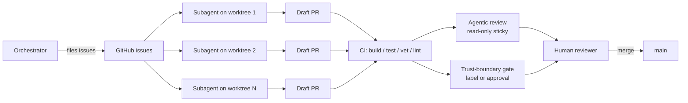
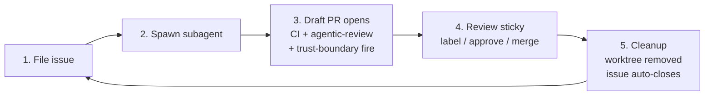

# claude-code-setup

> Opinionated template for running an orchestrator + autonomous-subagent setup against a single GitHub repository, distilled from operating practice on [`jk-nd/go-mcp-gw`](https://github.com/jk-nd/go-mcp-gw).

## TL;DR

| | |
| --- | --- |
| What you get | Agentic PR review (read-only), trust-boundary CI gate, CODEOWNERS, issue + PR templates, `AGENTS.md` operating principles, bootstrap script |
| What you bring | A language-specific `ci.yml` (template ships a Go example), team handles, branch-protection settings |
| How to start | Click "Use this template" on GitHub, then run `scripts/bootstrap.sh` |
| Required secret | `ANTHROPIC_API_KEY` (only if you opt in to agentic review — see [Authentication](#authentication)) |
| Repo-level review on/off | Variable `AGENTIC_REVIEW_ENABLED=true` to turn it on; unset to turn off. **Default: off.** |
| Cost ceiling | Per-PR review capped at ~$0.83 worst case; opt-out per-PR via the `agentic-review:skip` label |

## What this gives you

The four moving parts:

1. **Orchestrator + subagents on worktrees.** One human-driven orchestrator files issues; subagents work autonomously on isolated branches, opening draft PRs.
2. **Agentic PR review** (`.github/workflows/agentic-review.yml` + `cmd/agentic-review/`). Read-only Claude review on every non-draft PR push, posting a sticky comment with findings against six dimensions (lint, tests, citations, issue refs, architectural invariants, stale claims).
3. **Trust-boundary CI gate** (`.github/workflows/trust-boundary.yml`). Compliance-routed PRs require either the `compliance-review` label or an approving review on the current HEAD; sticky comment summarises which paths tripped the gate.
4. **Issue + PR templates** (`.github/ISSUE_TEMPLATE/`, `.github/PULL_REQUEST_TEMPLATE.md`). Five issue archetypes (epic, sub-issue, hardening, testing, ci) and a PR template that mirrors the structure agents follow.

## Operating loop

Once bootstrapped, the day-to-day loop is: **file an issue → spawn a subagent → review the draft PR → merge.** The agent does the work on an isolated worktree, opens a draft PR, and CI + agentic-review + trust-boundary gate all fire automatically. You read the sticky review, label / approve, and merge. Issue auto-closes via `Closes #N`.

See [`docs/operating.md`](docs/operating.md) for the step-by-step walkthrough, including agent-prompt templates and a troubleshooting matrix.

## How to use

1. Click **Use this template** in the GitHub UI to create a new repo from this one.
2. Clone the new repo locally.
3. Run `scripts/bootstrap.sh`. The script will:
   - Detect owner/name from `gh repo view`.
   - Substitute `${OWNER}`, `${REPO}`, `${WATCHED_PATHS}` placeholders across `*.template` files and rename them to their final names.
   - Prompt whether to enable **agentic PR review** for this repo. If yes, it sets the `AGENTIC_REVIEW_ENABLED=true` repo variable and prompts for `ANTHROPIC_API_KEY`. If no, the workflow ships in the repo but stays silent until you opt in later.
   - Create the `compliance-review` label.
   - Optionally create initial branch protection on `main`.
4. Replace the Go-flavoured `.github/workflows/ci.yml` with one for your stack (the template ships a Go example as a starting point).
5. Edit `.github/CODEOWNERS` to reference your real team handles.
6. Open a PR and watch the trust-boundary workflow fire (and agentic-review if you opted in).

See [`docs/setup.md`](docs/setup.md) for a step-by-step walkthrough and troubleshooting.

## What's in the box

| Path | Purpose |
| --- | --- |
| `AGENTS.md` | Operating principles for orchestrator + subagents. Read this first. |
| `.github/workflows/agentic-review.yml` | Read-only Claude PR review. Sticky-comment pattern. |
| `.github/workflows/trust-boundary.yml` | Compliance gate keyed off watched paths + label / approval. |
| `.github/workflows/ci.yml.template` | Go-flavoured example CI; replace with your stack's toolchain. |
| `.github/CODEOWNERS.template` | Skeleton with `${WATCHED_PATHS}` and `${OWNER}` placeholders. |
| `.github/ISSUE_TEMPLATE/` | Five archetypes: epic, sub-issue, hardening, testing, ci. |
| `.github/PULL_REQUEST_TEMPLATE.md` | Summary / Test plan / Boundaries / Closes. |
| `cmd/agentic-review/` | Stdlib-only Go binary that drives the read-only review. |
| `docs/agentic-review.md` | Operator-facing docs: cost, opt-out, safety boundaries. |
| `docs/setup.md` | Bootstrap walkthrough. |
| `scripts/bootstrap.sh` | Idempotent setup script: placeholders, secrets, labels, branch protection. |

## What's not

This template is intentionally narrow. It does **not** ship:

- A language-specific build pipeline. The `ci.yml.template` example uses Go; replace it with your toolchain (Node, Python, Rust, etc.). The agentic-review and trust-boundary workflows are language-agnostic.
- Pre-populated team handles. `${OWNER}` is filled in by the bootstrap script; `compliance-review` is a placeholder team you must create in your org.
- Branch-protection rules pre-applied. The bootstrap script offers to create them; you decide which checks are required.
- Auto-deletion of `scripts/bootstrap.sh`. The script is idempotent — keep it for re-runs.

## Authentication

The agentic-review workflow needs to call Claude. There are three ways to wire that up; the trust-boundary gate and standard CI work regardless.

### Option A — bring your own `ANTHROPIC_API_KEY` (paid)

The default path. The bootstrap script prompts for the key and sets it as a repo secret via `gh secret set`. The shipped `cmd/agentic-review` binary calls the Anthropic Messages API directly with that key.

- **Cost:** ~$0.05–$0.20 per PR push at current Opus pricing; per-PR ceiling capped at ~$0.83 by the binary's input/output token caps. See [`docs/agentic-review.md`](docs/agentic-review.md#cost-expectations) for the full table.
- **Cleanest path** — works in any GitHub Actions context, no extra apps to install, no separate auth flow.
- **Best for:** teams already paying for Anthropic API usage, or where adding an org-level API key is administratively simple.

### Option B — use Anthropic's `claude-code-action` GitHub Action

Anthropic ships a first-party action at [`anthropics/claude-code-action`](https://github.com/anthropics/claude-code-action) for running Claude inside GitHub Actions. Its auth model is documented on the action's README — **consult that source directly before adopting this option**, as the auth flow has evolved over time and may include OAuth via a GitHub App, an API key, or other modes depending on the version.

> **Verify before claiming subscription-piggybacking.** This template's authors did not make a specific subscription claim because we could not reach the action's README from the agent runner network when this section was written. If you're considering Option B, read [`https://github.com/anthropics/claude-code-action#authentication`](https://github.com/anthropics/claude-code-action#authentication) (or whichever section is current) and confirm the auth model fits your billing setup.
>
> **Adoption note:** if you choose this option you will need to swap the `agentic-review.yml` workflow to invoke the action instead of running the bundled `cmd/agentic-review` binary. The static-checks logic in this template is independent of the LLM call, so you can keep it; only the Anthropic call changes.

### Option C — skip agentic review entirely

The template ships with the workflow gated on the `AGENTIC_REVIEW_ENABLED` repo variable. **If you don't set that variable, the workflow is silent** — it runs the trigger but the job's `if:` evaluates to false, so no checkout, no API call, no comment. The trust-boundary CI gate and standard CI continue to work; you lose the read-only PR review automation but keep the compliance-routing and quality gates.

To turn it on later: set the `AGENTIC_REVIEW_ENABLED` variable to `'true'` (Settings → Secrets and variables → Variables) and supply `ANTHROPIC_API_KEY`. To turn it off again: unset the variable.

- **Cost:** $0.
- **Best for:** teams not yet ready to commit to API spend or to a third-party action, but who want the trust-boundary gate today.

| Option | Up-front cost | Per-PR cost | Auth admin effort |
| --- | --- | --- | --- |
| A — own API key | API key | ~$0.05–$0.20 | one secret |
| B — `claude-code-action` | varies (see action's README) | varies | depends on action's model |
| C — skip review | none | $0 | none |

You can switch between options later by re-running `scripts/bootstrap.sh` (for A) or by editing `.github/workflows/agentic-review.yml` (for B / C).

## Origin

This template is distilled from operating practice on [`jk-nd/go-mcp-gw`](https://github.com/jk-nd/go-mcp-gw). The agentic-review binary is ported verbatim (with paths generalised). The trust-boundary workflow's logic is identical; only the watched paths and citations are placeholdered. The issue-template archetypes mirror the issue bodies that worked best in practice for an orchestrator-driven workflow.

The mental model is opinionated: GitHub-issue-driven, draft-PR-first, never-merge-from-an-agent, always-rebase-onto-main, always-respect-the-trust-boundary. Read [`AGENTS.md`](AGENTS.md) for the full operating contract.

## License

Apache 2.0. See [`LICENSE`](LICENSE).
