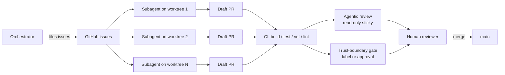
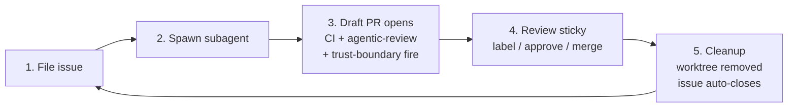

# claude-code-setup

> Opinionated template for running an orchestrator + autonomous-subagent setup against a single GitHub repository, distilled from operating practice on [`jk-nd/go-mcp-gw`](https://github.com/jk-nd/go-mcp-gw).

## TL;DR

| | |
| --- | --- |
| What you get | Agentic PR review (read-only), trust-boundary CI gate, CODEOWNERS, issue + PR templates, `AGENTS.md` operating principles, bootstrap script |
| What you bring | A language-specific `ci.yml` (template ships a Go example), team handles, branch-protection settings |
| How to start | Click "Use this template" on GitHub, then run `scripts/bootstrap.sh` |
| Required secret | None for the **default backend** (GitHub Models, free-tier, authed via `GITHUB_TOKEN`). `ANTHROPIC_API_KEY` is only needed if you opt in to the Anthropic-direct backend — see [Authentication](#authentication). |
| Repo-level review on/off | Variable `AGENTIC_REVIEW_ENABLED=true` to turn it on; unset to turn off. Backend selected via `AGENTIC_REVIEW_BACKEND=github-models` (default) or `anthropic`. |
| Cost ceiling | $0 on the GitHub Models backend (free tier); ~$0.83 worst-case per PR on the Anthropic-direct backend. Opt out per-PR via the `agentic-review:skip` label. |

## What this gives you



The four moving parts:

1. **Orchestrator + subagents on worktrees.** One human-driven orchestrator files issues; subagents work autonomously on isolated branches, opening draft PRs.
2. **Agentic PR review** (`.github/workflows/agentic-review.yml` + `cmd/agentic-review/`). Read-only Claude review on every non-draft PR push, posting a sticky comment with findings against six dimensions (lint, tests, citations, issue refs, architectural invariants, stale claims).
3. **Trust-boundary CI gate** (`.github/workflows/trust-boundary.yml`). Compliance-routed PRs require either the `compliance-review` label or an approving review on the current HEAD; sticky comment summarises which paths tripped the gate.
4. **Issue + PR templates** (`.github/ISSUE_TEMPLATE/`, `.github/PULL_REQUEST_TEMPLATE.md`). Five issue archetypes (epic, sub-issue, hardening, testing, ci) and a PR template that mirrors the structure agents follow.

## Operating loop

Once bootstrapped, the day-to-day loop is: **file an issue → spawn a subagent → review the draft PR → merge.** The agent does the work on an isolated worktree, opens a draft PR, and CI + agentic-review + trust-boundary gate all fire automatically. You read the sticky review, label / approve, and merge. Issue auto-closes via `Closes #N`.



See [`docs/operating.md`](docs/operating.md) for the step-by-step walkthrough, including agent-prompt templates and a troubleshooting matrix.

## How to use

1. Click **Use this template** in the GitHub UI to create a new repo from this one.
2. Clone the new repo locally.
3. Run `scripts/bootstrap.sh`. The script will:
   - Detect owner/name from `gh repo view`.
   - Substitute `${OWNER}`, `${REPO}`, `${WATCHED_PATHS}` placeholders across `*.template` files and rename them to their final names.
   - Prompt whether to enable **agentic PR review** for this repo (default: yes). If yes, it asks which backend (default: GitHub Models, free tier; alternatively Anthropic API direct). For GitHub Models, no secret is required — the workflow uses `GITHUB_TOKEN`. For Anthropic-direct, the script prompts for `ANTHROPIC_API_KEY`. If you decline, the workflow ships in the repo but stays silent until you opt in later.
   - Create the `compliance-review` label.
   - Optionally create initial branch protection on `main`.
4. Replace the Go-flavoured `.github/workflows/ci.yml` with one for your stack (the template ships a Go example as a starting point).
5. Edit `.github/CODEOWNERS` to reference your real team handles.
6. Open a PR and watch the trust-boundary workflow fire (and agentic-review if you opted in).

See [`docs/setup.md`](docs/setup.md) for a step-by-step walkthrough and troubleshooting.

## What's in the box

| Path | Purpose |
| --- | --- |
| `AGENTS.md` | Operating principles for orchestrator + subagents. Read this first. |
| `.github/workflows/agentic-review.yml` | Read-only Claude PR review. Sticky-comment pattern. |
| `.github/workflows/trust-boundary.yml` | Compliance gate keyed off watched paths + label / approval. |
| `.github/workflows/ci.yml.template` | Go-flavoured example CI with paths-filter pattern + actionlint gate; replace with your stack's toolchain. |
| `.github/workflows/govulncheck.yml.template` | (Opt-in) Weekly Go vulnerability scan + per-PR scan on `go.mod` changes. |
| `.github/workflows/nightly.yml.template` | (Opt-in) Slow-tests + extended fuzz harness on a daily cron. |
| `.github/dependabot.yml.template` | (Opt-in) Weekly dependency bumps for Go modules + GitHub Actions. |
| `.github/CODEOWNERS.template` | Skeleton with `${WATCHED_PATHS}` and `${OWNER}` placeholders. |
| `.github/ISSUE_TEMPLATE/` | Five archetypes: epic, sub-issue, hardening, testing, ci. |
| `.github/PULL_REQUEST_TEMPLATE.md` | Summary / Test plan / Boundaries / Closes. |
| `cmd/agentic-review/` | Stdlib-only Go binary that drives the read-only review. |
| `cmd/coverage-gate/` | (Opt-in) Stdlib-only Go binary that enforces a per-package coverage baseline. |
| `ops/coverage-baseline.json.example` | Starter baseline for the coverage gate; copy to `ops/coverage-baseline.json` to enable. |
| `templates/claude-settings.json.template` | (Opt-in) Curated permissions allowlist for Claude Code subagents working in the repo. Bootstrap copies it to `.claude/settings.json`. |
| `docs/agentic-review.md` | Operator-facing docs: cost, opt-out, safety boundaries. |
| `docs/setup.md` | Bootstrap walkthrough, coverage-gate procedure, pre-push hook docs. |
| `scripts/bootstrap.sh` | Idempotent setup script: placeholders, secrets, labels, opt-in template renames, branch protection. |
| `scripts/install-pre-push-hook.sh` | Standalone installer for the strict-recipe pre-push hook (refuses dirty-tree push, runs build/vet/short-test/`go mod tidy` diff). |

## What's not

This template is intentionally narrow. It does **not** ship:

- A language-specific build pipeline. The `ci.yml.template` example uses Go; replace it with your toolchain (Node, Python, Rust, etc.). The agentic-review and trust-boundary workflows are language-agnostic.
- Pre-populated team handles. `${OWNER}` is filled in by the bootstrap script; `compliance-review` is a placeholder team you must create in your org.
- Branch-protection rules pre-applied. The bootstrap script offers to create them; you decide which checks are required.
- Auto-deletion of `scripts/bootstrap.sh`. The script is idempotent — keep it for re-runs.

## Authentication

The agentic-review workflow needs to call Claude. There are three ways to wire that up; the trust-boundary gate and standard CI work regardless.

| Option | Backend | Per-PR cost | Auth admin effort | Best for |
| --- | --- | --- | --- | --- |
| **A (default)** — GitHub Models | OpenAI-compatible endpoint hosted by GitHub | $0 (free tier) | none — uses workflow `GITHUB_TOKEN` | Personal repos, individual developers, anyone who wants the review running on day one without billing setup |
| **B** — Anthropic API direct | Anthropic Messages API | ~$0.05–$0.20 typical, ~$0.83 ceiling | one repo secret (`ANTHROPIC_API_KEY`) | Teams already paying Anthropic, or running so many PRs that the GitHub Models free-tier cap becomes a constraint |
| **C** — disabled | (no LLM call) | $0 | none | Teams not yet ready to opt in; trust-boundary + CI continue to work |

You can switch backends later by re-running `scripts/bootstrap.sh` or editing the `AGENTIC_REVIEW_BACKEND` repo variable. The two binaries share the same prompt and post the same sticky-comment shape; only the API call layer changes.

### Option A — GitHub Models (default, free tier)

The default path on a fresh template instantiation. GitHub Models is GitHub's hosted OpenAI-compatible inference endpoint at `https://models.github.ai/inference/`; it accepts the workflow's `GITHUB_TOKEN` as a bearer token when the workflow declares `permissions: { models: read }`. The shipped `cmd/agentic-review` binary's `github-models` adapter calls that endpoint with the model identifier `anthropic/claude-sonnet-4.5` (overridable via `AGENTIC_REVIEW_GITHUB_MODELS_MODEL`).

- **Cost:** $0 on the published free tier. Rate limits are generous for low-volume use (one LLM call per PR push, ~50K input / 2K output tokens, concurrency-cancelled on a fresh push). When the free-tier window is exhausted, the adapter surfaces a `429 rate-limited` error in the degraded-mode comment and the next push retries.
- **Setup:** zero extra steps. The bootstrap script defaults to this backend; no secret is required.
- **Best for:** personal repos and individual developers — removes the per-PR cost concern that historically pushed solo maintainers to skip the review entirely.

### Option B — Anthropic API direct (paid)

The historical default. The bootstrap script prompts for an Anthropic API key when the operator picks this backend and sets it as a repo secret via `gh secret set`. The shipped `cmd/agentic-review` binary's `anthropic` adapter calls the Anthropic Messages API directly with that key.

- **Cost:** ~$0.05–$0.20 per PR push at current Opus pricing; per-PR ceiling capped at ~$0.83 by the binary's input/output token caps. See [`docs/agentic-review.md`](docs/agentic-review.md#cost-expectations) for the full table.
- **Setup:** set `AGENTIC_REVIEW_BACKEND=anthropic` (repo variable) and `ANTHROPIC_API_KEY` (repo secret). The bootstrap script does both.
- **Best for:** teams already paying for Anthropic API usage, or where adding an org-level API key is administratively simple.

### Option C — skip agentic review entirely

The template ships with the workflow gated on the `AGENTIC_REVIEW_ENABLED` repo variable. **If you don't set that variable, the workflow is silent** — it runs the trigger but the job's `if:` evaluates to false, so no checkout, no API call, no comment. The trust-boundary CI gate and standard CI continue to work; you lose the read-only PR review automation but keep the compliance-routing and quality gates.

To turn it on later: set `AGENTIC_REVIEW_ENABLED=true` and pick a backend. To turn it off again: unset the variable.

- **Cost:** $0.
- **Best for:** teams not yet ready to commit to either backend, but who want the trust-boundary gate today.

### Switching between options

Re-run `scripts/bootstrap.sh` (the safest path — it idempotently updates the repo variables and only re-prompts for the secret if the chosen backend needs one), or set the variables directly:

```sh
# Switch to GitHub Models (default; no secret required).
gh variable set AGENTIC_REVIEW_BACKEND --repo $OWNER/$REPO --body github-models

# Switch to Anthropic-direct (requires ANTHROPIC_API_KEY repo secret).
gh variable set AGENTIC_REVIEW_BACKEND --repo $OWNER/$REPO --body anthropic
gh secret   set ANTHROPIC_API_KEY      --repo $OWNER/$REPO

# Disable entirely.
gh variable delete AGENTIC_REVIEW_ENABLED --repo $OWNER/$REPO
```

## Origin

This template is distilled from operating practice on [`jk-nd/go-mcp-gw`](https://github.com/jk-nd/go-mcp-gw). The agentic-review binary is ported verbatim (with paths generalised). The trust-boundary workflow's logic is identical; only the watched paths and citations are placeholdered. The issue-template archetypes mirror the issue bodies that worked best in practice for an orchestrator-driven workflow.

The mental model is opinionated: GitHub-issue-driven, draft-PR-first, never-merge-from-an-agent, always-rebase-onto-main, always-respect-the-trust-boundary. Read [`AGENTS.md`](AGENTS.md) for the full operating contract.

## License

Apache 2.0. See [`LICENSE`](LICENSE).
