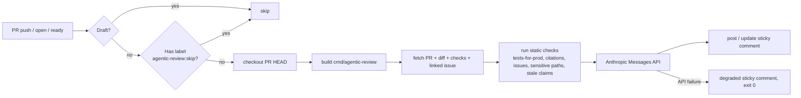

# Agentic PR review (read-only)

> Status: **read-only** — the agent posts a sticky comment. There is no auto-fix loop.

## TL;DR

| | |
| --- | --- |
| Where it runs | `.github/workflows/agentic-review.yml` |
| What it touches | One sticky comment per PR (marker `<!-- agentic-review:sticky -->`) |
| What it does **not** touch | Branch contents, labels, reviews, merges, anything outside the comment |
| Skip per-PR | Apply the label `agentic-review:skip` |
| Required secret | `ANTHROPIC_API_KEY` in repo settings |
| Cost ballpark | ~$0.05–$0.20 per PR push at current Opus pricing |

## What it does



The Go binary `cmd/agentic-review/main.go` is a small stdlib-only program. It is built fresh on every run (no separate release artefact to keep in sync with `main`).

## The six review dimensions

The system prompt asks the model to reason over six rubric dimensions.

| # | Dimension | Where the signal comes from |
| --- | --- | --- |
| 1 | Lint clean | CI check-run summary (`/repos/{owner}/{repo}/commits/{sha}/check-runs`) |
| 2 | Tests added if production code changed | Static heuristic: production source file under `internal/`, `cmd/`, or `pkg/` touched without a `_test.go` in the same dir |
| 3 | Citations resolve | Static check: every repo-relative path mentioned in the PR body must exist in the checked-out worktree |
| 4 | Issue numbers resolve | Static check: every `#NN` reference in the PR body must point to a non-404 issue |
| 5 | Architectural invariants | Static signal (sensitive paths touched, configured via the `SENSITIVE_PATHS` env var) + LLM judgement |
| 6 | Stale claims | Static check: if the body says "uses #N", the diff must contain a literal `#N` somewhere |

The static checks (2, 3, 4, 5-signal, 6) are **deterministic** — they run in the binary, not in the model. The model receives them as a "Static checks" block in the prompt and reasons about severity. This keeps the auditable parts auditable and the judgemental parts in the model.

To extend the architectural-invariants check to your project's compliance-sensitive paths, set `SENSITIVE_PATHS` in the workflow's `Run review` step:

```yaml
- name: Run review
  env:
    GITHUB_TOKEN: ${{ secrets.GITHUB_TOKEN }}
    ANTHROPIC_API_KEY: ${{ secrets.ANTHROPIC_API_KEY }}
    GITHUB_REPOSITORY: ${{ github.repository }}
    PR_NUMBER: ${{ github.event.pull_request.number }}
    GITHUB_WORKSPACE: ${{ github.workspace }}
    SENSITIVE_PATHS: "internal/policy/,internal/audit/,internal/auth/"
  run: /tmp/agentic-review
```

The list should mirror the watched paths in `.github/workflows/trust-boundary.yml`.

## How to read the sticky comment

```markdown
<!-- agentic-review:sticky -->
## Agentic PR review (read-only)

## Pass / Concerns

- Two MED concerns; otherwise clean.

## Passes

- Lint clean (CI lint job: success).
- Issue refs resolve (#196).
- Stale-claim check: no `uses #N` in body.

## Concerns

- **MED** — Tests-for-prod: `internal/audit` was modified but no `_test.go` was touched in that dir.
- **MED** — Citations: PR body cites `docs/missing.md`; the path does not exist on HEAD.

## Open questions for the reviewer

- Is the absence of a unit test for `Emitter.WriteRecord` covered by the existing integration test in `test/e2e/audit_test.go`?

---
_Read-only review by Claude (model `claude-opus-4-7-1m`). Tokens: in=12500 / out=420. Estimated cost: $0.2190. Disable for this PR by adding the `agentic-review:skip` label. See [`docs/agentic-review.md`](../blob/main/docs/agentic-review.md)._
```

Severity vocabulary:

| Severity | When the model should use it |
| --- | --- |
| **HIGH** | Compliance-relevant defect (audit not emitted, auth not wired, stale citation in a sensitive doc) |
| **MED** | Quality defect with a clear remediation (missing tests, broken citation) |
| **LOW** | Style or naming nit, minor inconsistency |

## How to opt out

Apply the label `agentic-review:skip` to the PR. The workflow's job-level `if:` skips the entire job when the label is present, so no API call is made.

To opt back in, remove the label. The workflow runs again on the next push (or you can push an empty commit / re-request review to trigger it manually).

## Cost expectations

Approximate, at current Opus pricing ($15 / $75 per Mtok):

| PR size | Input tokens | Output tokens | Cost |
| --- | --- | --- | --- |
| Small (1 file, < 100 lines diff) | ~3K | ~300 | ~$0.07 |
| Medium (5–10 files, < 500 lines) | ~15K | ~600 | ~$0.27 |
| Large (truncated to budget) | ~50K (cap) | ~1K (cap) | ~$0.83 |

The actual per-PR cost is logged in two places:

- **Workflow step summary** — table with input / output tokens and USD estimate.
- **Sticky comment footer** — `Tokens: in=X / out=Y. Estimated cost: $Z.`

The cap of 50K input / 2K output tokens is enforced in the binary; any diff that exceeds the input cap is shrunk by dropping the bodies of files larger than 200 lines (file headers are kept so the model knows what was elided).

## When it cannot run

The workflow exits 0 in all of these cases — the read-only review must never block CI on agent-infrastructure issues.

| Cause | Behaviour |
| --- | --- |
| `ANTHROPIC_API_KEY` secret not set | Posts a degraded sticky comment explaining the missing secret; no API call is made. |
| Anthropic API call fails (5xx, timeout, malformed response) | Posts a degraded sticky comment with a redacted error excerpt; the next push retries automatically. |
| The PR is a draft | Job is skipped (no comment). |
| The PR has the `agentic-review:skip` label | Job is skipped (no comment). |

## Safety boundaries

The review is read-only **by design**. The binary:

- Has GitHub permission `pull-requests: write` and `issues: write` only — no `contents: write`.
- Never pushes commits, never updates labels, never submits reviews.
- Touches a single comment per PR (creates one, updates that same one on subsequent pushes).
- Never modifies `.github/workflows/`.
- Never bypasses the trust-boundary gate.

These guarantees come from the workflow's `permissions:` block, not the binary's discretion.

## Operator setup checklist

1. Ensure `ANTHROPIC_API_KEY` is set as a repo secret (Settings → Secrets and variables → Actions). The bootstrap script (`scripts/bootstrap.sh`) does this.
2. Optional: create the `agentic-review:skip` label (the workflow gracefully tolerates its absence).
3. Open or push a PR. The job runs automatically.
4. After one week, review the sticky-comment shape on closed PRs to decide whether to invest in any auto-fix tooling beyond this read-only baseline.

## Related

- Workflow [`.github/workflows/agentic-review.yml`](../.github/workflows/agentic-review.yml).
- Binary [`cmd/agentic-review/main.go`](../cmd/agentic-review/main.go).
- Trust-boundary gate [`.github/workflows/trust-boundary.yml`](../.github/workflows/trust-boundary.yml) — separate compliance gate; the agentic review does not replace it.
