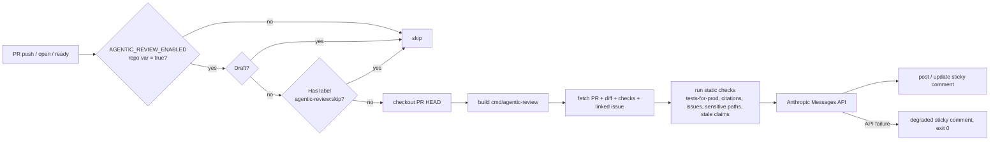
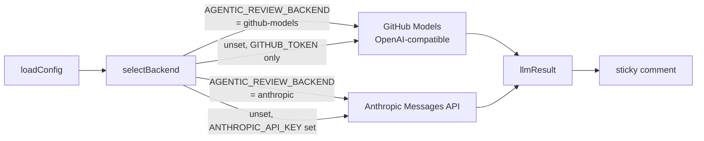

# Agentic PR review (read-only)

> Status: **read-only** — the agent posts a sticky comment. There is no auto-fix loop.

## TL;DR

| | |
| --- | --- |
| Where it runs | `.github/workflows/agentic-review.yml` |
| What it touches | One sticky comment per PR (marker `<!-- agentic-review:sticky -->`) |
| What it does **not** touch | Branch contents, labels, reviews, merges, anything outside the comment |
| Repo-level on/off | Set repo variable `AGENTIC_REVIEW_ENABLED=true` (Settings → Secrets and variables → Variables). Unset = silent. |
| Auth backend | Repo variable `AGENTIC_REVIEW_BACKEND=github-models` (default, free tier) or `anthropic` (paid, direct). See [§Auth backends](#auth-backends). |
| Skip per-PR | Apply the label `agentic-review:skip` (or keep PR draft) |
| Required secret | None for the GitHub Models backend; `ANTHROPIC_API_KEY` for the Anthropic-direct backend. |
| Cost ballpark | $0 on GitHub Models (free tier); ~$0.05–$0.20 per PR push on Anthropic-direct (Opus pricing) |

## What it does



The Go binary `cmd/agentic-review/main.go` is a small stdlib-only program. It is built fresh on every run (no separate release artefact to keep in sync with `main`).

## Auth backends

The binary supports two LLM backends behind a common `ReviewBackend` interface (`cmd/agentic-review/backend_anthropic.go` and `cmd/agentic-review/backend_github_models.go`). The workflow injects the same prompt to whichever backend is selected; only the API call layer differs.



| | GitHub Models | Anthropic direct |
| --- | --- | --- |
| Endpoint | `https://models.github.ai/inference/chat/completions` | `https://api.anthropic.com/v1/messages` |
| Auth header | `Authorization: Bearer ${{ secrets.GITHUB_TOKEN }}` | `x-api-key: $ANTHROPIC_API_KEY` |
| Workflow permission | `permissions: { models: read }` (declared in shipped workflow) | none (the API key carries auth) |
| Default model | `anthropic/claude-sonnet-4.5` | `claude-opus-4-7-1m` |
| Override model | `AGENTIC_REVIEW_GITHUB_MODELS_MODEL` env var | constant in `backend_anthropic.go` (bump and rebuild) |
| Wire format | OpenAI-compatible (`{model, messages, max_tokens}` request, `{choices: [{message: {content}}]}` response) | Anthropic Messages (`{system, messages}` request, `{content: [{text}]}` response) |
| Cost | Free at the published rate-limit tier | ~$15/MTok input, ~$75/MTok output (Opus snapshot) |
| Per-PR cost | $0 | ~$0.05–$0.83 (capped by 50K input / 2K output token limits) |

### Backend selection logic

`selectBackend` (in `cmd/agentic-review/main.go`) decides which backend to use, in this order:

1. If `AGENTIC_REVIEW_BACKEND=github-models`, use GitHub Models. Requires `GITHUB_TOKEN` (always set in workflow runs); degrades if missing.
2. If `AGENTIC_REVIEW_BACKEND=anthropic`, use Anthropic. Requires `ANTHROPIC_API_KEY`; degrades if missing.
3. If unset and only `GITHUB_TOKEN` is present, use GitHub Models (the personal-account-friendly default).
4. If unset and `ANTHROPIC_API_KEY` is set, use Anthropic.
5. If neither token is available, post the existing degraded-mode comment and exit 0.

### How to switch backends

```sh
# Default (free tier; no secret required).
gh variable set AGENTIC_REVIEW_BACKEND --repo $OWNER/$REPO --body github-models

# Anthropic-direct (paid; requires ANTHROPIC_API_KEY).
gh variable set AGENTIC_REVIEW_BACKEND --repo $OWNER/$REPO --body anthropic
gh secret   set ANTHROPIC_API_KEY      --repo $OWNER/$REPO

# Override the GitHub Models model identifier (no rebuild required).
gh variable set AGENTIC_REVIEW_GITHUB_MODELS_MODEL --repo $OWNER/$REPO --body anthropic/claude-sonnet-4.5
```

The variable is consumed by the workflow's `Run review` step; the next PR push picks it up automatically. No code change.

### Rate-limit behaviour (GitHub Models)

GitHub Models enforces a per-account rate limit on the free tier. When exhausted, the endpoint returns HTTP 429; the binary surfaces this as a degraded sticky comment with the message **"github models rate-limited (HTTP 429): … Wait for the rate-limit window to reset, or switch backends to anthropic"**. The workflow exits 0; the next push retries automatically.

For sustained high volume (many concurrent PRs), the Anthropic-direct backend has higher published throughput; switch via the variable.

## The six review dimensions

The system prompt asks the model to reason over six rubric dimensions.

| # | Dimension | Where the signal comes from |
| --- | --- | --- |
| 1 | Lint clean | CI check-run summary (`/repos/{owner}/{repo}/commits/{sha}/check-runs`) |
| 2 | Tests added if production code changed | Static heuristic: production source file under `internal/`, `cmd/`, or `pkg/` touched without a `_test.go` in the same dir |
| 3 | Citations resolve | Static check: every repo-relative path mentioned in the PR body must exist in the checked-out worktree |
| 4 | Issue numbers resolve | Static check: every `#NN` reference in the PR body must point to a non-404 issue |
| 5 | Architectural invariants | Static signal (sensitive paths touched, configured via the `SENSITIVE_PATHS` env var) + LLM judgement |
| 6 | Stale claims | Static check: if the body says "uses #N", the diff must contain a literal `#N` somewhere |

The static checks (2, 3, 4, 5-signal, 6) are **deterministic** — they run in the binary, not in the model. The model receives them as a "Static checks" block in the prompt and reasons about severity. This keeps the auditable parts auditable and the judgemental parts in the model.

To extend the architectural-invariants check to your project's compliance-sensitive paths, set `SENSITIVE_PATHS` in the workflow's `Run review` step:

```yaml
- name: Run review
  env:
    GITHUB_TOKEN: ${{ secrets.GITHUB_TOKEN }}
    ANTHROPIC_API_KEY: ${{ secrets.ANTHROPIC_API_KEY }}
    AGENTIC_REVIEW_BACKEND: ${{ vars.AGENTIC_REVIEW_BACKEND }}
    GITHUB_REPOSITORY: ${{ github.repository }}
    PR_NUMBER: ${{ github.event.pull_request.number }}
    GITHUB_WORKSPACE: ${{ github.workspace }}
    SENSITIVE_PATHS: "internal/policy/,internal/audit/,internal/auth/"
  run: /tmp/agentic-review
```

The list should mirror the watched paths in `.github/workflows/trust-boundary.yml`.

## How to read the sticky comment

```markdown
<!-- agentic-review:sticky -->
## Agentic PR review (read-only)

## Pass / Concerns

- Two MED concerns; otherwise clean.

## Passes

- Lint clean (CI lint job: success).
- Issue refs resolve (#42).
- Stale-claim check: no `uses #N` in body.

## Concerns

- **MED** — Tests-for-prod: `internal/audit` was modified but no `_test.go` was touched in that dir.
- **MED** — Citations: PR body cites `docs/missing.md`; the path does not exist on HEAD.

## Open questions for the reviewer

- Is the absence of a unit test for `Emitter.WriteRecord` covered by the existing integration test in `test/e2e/audit_test.go`?

---
_Read-only review by Claude via GitHub Models (model `anthropic/claude-sonnet-4.5`). Tokens: in=12500 / out=420. Estimated cost: $0.0000. Disable for this PR by adding the `agentic-review:skip` label. See [`docs/agentic-review.md`](../blob/main/docs/agentic-review.md)._
```

Severity vocabulary:

| Severity | When the model should use it |
| --- | --- |
| **HIGH** | Compliance-relevant defect (audit not emitted, auth not wired, stale citation in a sensitive doc) |
| **MED** | Quality defect with a clear remediation (missing tests, broken citation) |
| **LOW** | Style or naming nit, minor inconsistency |

## How to opt out

Apply the label `agentic-review:skip` to the PR. The workflow's job-level `if:` skips the entire job when the label is present, so no API call is made.

To opt back in, remove the label. The workflow runs again on the next push (or you can push an empty commit / re-request review to trigger it manually).

## Cost expectations

The actual per-PR cost depends on which backend is selected.

### GitHub Models backend (default)

Free at the published rate-limit tier. The sticky-comment footer reports `$0.0000` for every PR; the only practical constraint is the per-account rate limit (see [§Auth backends](#auth-backends)). Generous enough for typical solo-developer / small-team usage at one LLM call per PR push.

### Anthropic-direct backend

Approximate, at current Opus pricing ($15 / $75 per Mtok):

| PR size | Input tokens | Output tokens | Cost |
| --- | --- | --- | --- |
| Small (1 file, < 100 lines diff) | ~3K | ~300 | ~$0.07 |
| Medium (5–10 files, < 500 lines) | ~15K | ~600 | ~$0.27 |
| Large (truncated to budget) | ~50K (cap) | ~1K (cap) | ~$0.83 |

The actual per-PR cost is logged in two places:

- **Workflow step summary** — table with backend, model, input / output tokens, and USD estimate.
- **Sticky comment footer** — `Tokens: in=X / out=Y. Estimated cost: $Z.`

The cap of 50K input / 2K output tokens is enforced in the binary; any diff that exceeds the input cap is shrunk by dropping the bodies of files larger than 200 lines (file headers are kept so the model knows what was elided). The cap applies to both backends, so the GitHub Models free-tier window stays predictable.

## When it cannot run

The workflow exits 0 in all of these cases — the read-only review must never block CI on agent-infrastructure issues.

| Cause | Behaviour |
| --- | --- |
| `AGENTIC_REVIEW_ENABLED` repo variable is unset / not `'true'` | Job is skipped (no comment). This is the **default state** for a freshly-instantiated template — the operator must opt in. |
| Backend selected = `anthropic` but `ANTHROPIC_API_KEY` secret not set | Posts a degraded sticky comment explaining the missing secret; no API call is made. |
| Backend selected = `github-models` but `permissions: { models: read }` missing on the workflow | Posts a degraded sticky comment with the **"auth required"** message; no API call is made. The shipped workflow declares this permission — only an operator who hand-edited it can hit this path. |
| LLM API call fails (5xx, timeout, malformed response) | Posts a degraded sticky comment with a redacted error excerpt; the next push retries automatically. |
| GitHub Models endpoint returns 429 (free-tier rate limit exhausted) | Posts a degraded sticky comment naming the rate-limit; the next push retries automatically once the window resets. Operators with sustained volume can switch to the Anthropic-direct backend. |
| The PR is a draft | Job is skipped (no comment). |
| The PR has the `agentic-review:skip` label | Job is skipped (no comment). |

## Safety boundaries

The review is read-only **by design**. The binary:

- Has GitHub permission `pull-requests: write` and `issues: write` only — no `contents: write`.
- Never pushes commits, never updates labels, never submits reviews.
- Touches a single comment per PR (creates one, updates that same one on subsequent pushes).
- Never modifies `.github/workflows/`.
- Never bypasses the trust-boundary gate.

These guarantees come from the workflow's `permissions:` block, not the binary's discretion.

## Operator setup checklist

1. **Decide whether to run agentic review on this repo.** The template ships the workflow disabled by default; you opt in by setting the `AGENTIC_REVIEW_ENABLED` repo variable to `'true'` (Settings → Secrets and variables → **Variables** tab — note: it's a *variable*, not a *secret*, because there's no sensitive value).
2. **Pick a backend.** Set the `AGENTIC_REVIEW_BACKEND` repo variable to either `github-models` (default; free tier; no extra secret) or `anthropic` (paid; requires `ANTHROPIC_API_KEY`). If unset, the binary auto-detects from credentials.
3. **For Anthropic-direct only:** ensure `ANTHROPIC_API_KEY` is set as a repo *secret* (Settings → Secrets and variables → **Secrets** tab).
4. The bootstrap script (`scripts/bootstrap.sh`) prompts for steps 1–3.
5. Optional: create the `agentic-review:skip` label (the workflow gracefully tolerates its absence).
6. Open or push a PR. The job runs automatically when enabled.
7. To turn off temporarily: unset `AGENTIC_REVIEW_ENABLED` (or set to anything other than `'true'`). No code change required.
8. After one week of running with the variable on, review the sticky-comment shape on closed PRs to decide whether to invest in any auto-fix tooling beyond this read-only baseline.

## Related

- Workflow [`.github/workflows/agentic-review.yml`](../.github/workflows/agentic-review.yml).
- Binary [`cmd/agentic-review/main.go`](../cmd/agentic-review/main.go).
- Trust-boundary gate [`.github/workflows/trust-boundary.yml`](../.github/workflows/trust-boundary.yml) — separate compliance gate; the agentic review does not replace it.
