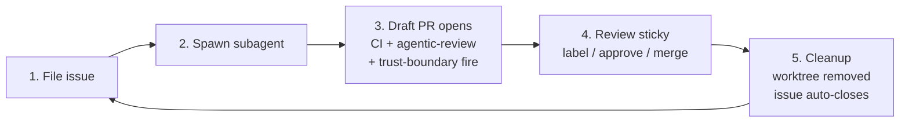

# Operating loop

> Day-to-day walkthrough for an orchestrator running this template. You bootstrapped the repo via `docs/setup.md`; this is the loop you run from then on.

## Daily loop overview

The five steps are linear per issue and run in parallel across many issues. The orchestrator (you) is the only entity that merges.

## Step 1 — file a GitHub issue

Pick the archetype that fits:

| Archetype | When | Template |
| --- | --- | --- |
| `epic` | Cross-cutting work, multi-day, splits into sub-issues | `.github/ISSUE_TEMPLATE/epic.md` |
| `sub-issue` | Single deliverable inside an epic | `.github/ISSUE_TEMPLATE/sub-issue.md` |
| `hardening` | Tightening behaviour of existing code (validation, error paths, security) | `.github/ISSUE_TEMPLATE/hardening.md` |
| `testing` | Adding or extending tests for existing code | `.github/ISSUE_TEMPLATE/testing.md` |
| `ci` | Touching workflows, CI infrastructure, or release plumbing | `.github/ISSUE_TEMPLATE/ci.md` |

Fill the template:

- **Acceptance** is checkboxes — each one independently verifiable. The agent will read these and treat them as the contract.
- **Scope** is numbered — each item maps to a commit or a clearly-delimited diff slice.
- **Citations** — link adjacent issues, reference paths in the codebase like `internal/foo/bar.go`. The agent's static checks (and the agentic review) will flag stale citations, so accuracy matters.

Tight, complete issue text saves you a re-prompt later.

## Step 2 — spawn a subagent from Claude Code

Open Claude Code's chat and paste a prompt of roughly this shape:

> "Implement GitHub issue #N for `<owner>/<repo>`. Branch from `origin/main` into `/tmp/<scratch>`. Work in that worktree using `git -C /tmp/<scratch> ...` so cwd doesn't drift. Verify build/test/vet/lint locally before push. Open a draft PR. Apply the `compliance-review` label if the PR touches a watched path. Do not merge."

`AGENTS.md` at the repo root is the contract the agent reads — branch rules, scope discipline, never-merge, never-force-push, etc. Your prompt only needs to pin **which issue**, **which scratch directory**, and remind it to draft-not-merge. The rest comes from `AGENTS.md`.

One issue per subagent. If the issue is too large to fit one agent, split it into sub-issues first.

## Step 3 — watch the PR build

Once the agent pushes its draft PR, three things fire on GitHub:

| Signal | Where | What it tells you |
| --- | --- | --- |
| **CI** | `.github/workflows/ci.yml` | Build / test / vet / lint pass on the agent's branch. Required check. |
| **Agentic review** (read-only) | `.github/workflows/agentic-review.yml` | Sticky comment with six-dimension findings (lint, tests, citations, issue refs, architectural invariants, stale claims). Never blocks. |
| **Trust-boundary gate** | `.github/workflows/trust-boundary.yml` | Fires if the PR touches a watched path. Status is **PENDING** until the `compliance-review` label is applied OR an APPROVED review on HEAD is registered. |

The agentic review re-runs on every push and updates the same sticky comment. The trust-boundary status flips to GREEN as soon as the label or approval lands; you don't need a fresh push.

## Step 4 — review and merge

1. Read the **agentic-review sticky comment** first. It surfaces the cheap-to-find issues — broken citations, missing tests, stale `uses #N` claims. Spend your reading budget on the rest.
2. Open the **diff**. The PR template's Boundaries section tells you what the agent claims it didn't cross; verify quickly.
3. If the diff touches a watched path: apply the **`compliance-review` label** (after a real compliance review — it is the audit trail).
4. Mark **ready-for-review** if the agent left it as draft.
5. **Merge.** Squash or rebase per your project's convention. The merge commit's `Closes #N` closes the issue automatically.

If something needs to change: leave a review comment, ask the agent to revise, repeat from Step 3.

## Step 5 — cleanup

After the merge:

- The linked issue closes automatically via the `Closes #N` ref in the PR body.
- The agent's worktree at `/tmp/<scratch>` is no longer needed. Remove it: `git worktree remove /tmp/<scratch>` (or just delete the directory if it was a plain clone).
- The branch on the remote can be auto-deleted via the GitHub repo setting "Automatically delete head branches" (recommended).

The next issue picks up at Step 1.

## What goes wrong, and what to do

| Symptom | Diagnosis | Fix |
| --- | --- | --- |
| Agent over-reaches scope (touches files outside the issue) | Issue text was loose, or `AGENTS.md` wasn't read | Re-prompt with stricter boundaries: "Revert changes to `<path>`. The issue scope was only `<files>`. Force-push to your branch is allowed for this." |
| Agent's PR fails CI | Local verification was skipped or environment differs | Read the **agentic-review sticky comment first** (it summarises the cheap signal). Then read the failing CI job's logs. Send the agent the failing-test name and ask it to fix in place. |
| Agent's PR conflicts with `main` | Another PR landed first | Ask the agent to rebase: `git -C /tmp/<scratch> fetch origin && git -C /tmp/<scratch> rebase origin/main`. Resolve conflicts, force-push the agent's own branch (never `main`). |
| Trust-boundary gate stays PENDING | Label not applied or HEAD changed since last approval | Apply `compliance-review` after review, or re-approve on the latest HEAD. The gate re-checks on each push. |
| Agentic review posts "Status: degraded — ANTHROPIC_API_KEY secret is not set" | Secret missing or the `claude-code-action` route was never finished | See the README's [Authentication](../README.md#authentication) section for the three options. |
| Two agents fight over the same scratch dir | Two prompts collided on `/tmp/<same-name>` | Use issue-numbered scratch dirs: `/tmp/cc-issue-<N>`. The orchestrator is responsible for naming. |

## Related

- [`AGENTS.md`](../AGENTS.md) — the contract every subagent reads.
- [`docs/setup.md`](setup.md) — one-time bootstrap.
- [`docs/agentic-review.md`](agentic-review.md) — what the read-only review does, and how to read its sticky.
- [`README.md`](../README.md) — top-level overview + Authentication section.
